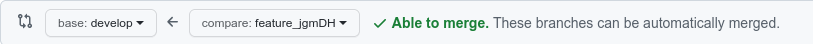
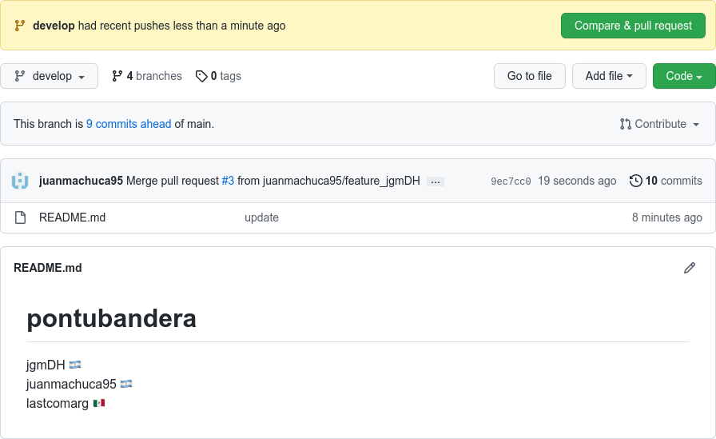

## Training Workflow Git

Como introducción a flujo de trabajo lo ideal seria leer toda la documentación https://docs.github.com/es/pull-requests/collaborating-with-pull-requests/reviewing-changes-in-pull-requests/about-pull-request-reviews

Una vez que estamos listos vamos a realizar un pequeño ejemplo practico

1. Crea un repositorio con el nombre <b>pontubandera</b> y con README.md - El objetivo sera actualizar el README.md con el nombre de todos los usuarios colaboradores y su bandera. Ej: jgmDH 🇦🇷 
2. Agrega a tus colaboradores
3. Clona el repositorio local
4. Selecciona alguien del equipo para crear la rama <b>develop</b>

```bash
cd pontubandera
# crear y se mueve a la rama develop
git checkout -b develop

# puseamos nuestra rama
git push -u origin develop
```

Ya tenemos las dos ramas - <b>main</b> y <b>develop</b>. Ahora crearemos las ramas donde trabajaremos nuestras <b>features</b>. Este proceso será el mismo para cada feature que inicie un colaborador o miembro del equipo.

```bash
# crea y se mueve a la rama feature_<username>
git checkout -b feature_jgmDH
```

Abrimos nuestro editor de texto preferido. Ej: Visual Studio Code y ingresamos una linea a nuestro README.md 

```html
jgmDH 🇦🇷 <br>
```

Guardamos y pusheamos a nuestra rama de trabajo.

```bash
git add . 
git commit -m "finish feature"
git push origin feature_jgmDH
```

Listo! 👍 Ahora vayamos a nuestra github page en nuestra rama de nuestra feature_jgmDH y observemos la opción <b>Contribute - Open pull request</b> de GitHub o también la opción <b>Compare & Pull request</b>



<b>🔥 IMPORTANTE:</b> apuntar siempre a develop la creación del <b>pull request</b> antes fusionar. También no olvides incluir una descripción o comentario.


## Iteramos este proceso en cada feature

Solo cuando terminemos de trabajar en nuestra rama de requerimientos realizamos el pull request a la rama develop. Cualquier miembro del equipo podra verificar el pull request y realizar la correspondiente revisión y resolución de conflictos para finalmente culminar el <b>merge pull request</b>



El objetivo será lograr un readme actualizado en rama develop, y como paso final. 

```bash 
git checkout develop
# traemos todos los cambios
git pull

git checkout -b release/1.0.0
git checkout main
git merge release/1.0.0
git push
```
